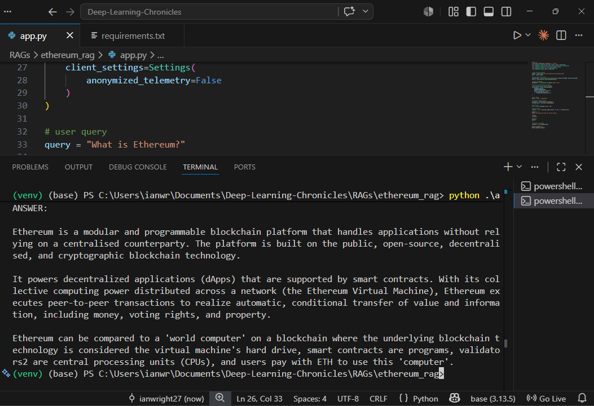

# Ethereum RAG (Local LLM + ChromaDB)



A fully local Retrieval-Augmented Generation (RAG) system that allows you to ask questions about Ethereum documentation using a local LLM (via Ollama), without any paid APIs.

This project demonstrates how to build an offline AI knowledge assistant using:
- Local embeddings
- Vector search (ChromaDB)
- PDF document ingestion
- Local LLM inference (Ollama)

---

## 🚀 Features

- Fully offline (no OpenAI or external APIs)
- PDF document ingestion
- Semantic search using embeddings
- Local vector database (ChromaDB)
- LLM-powered responses using Ollama
- Beginner-friendly RAG pipeline

---

## 🧠 Architecture

```

PDF Document
↓
Text Chunking
↓
Embeddings (Sentence Transformers / Ollama)
↓
ChromaDB Vector Store
↓
Similarity Search (Retrieval)
↓
Local LLM (Ollama)
↓
Final Answer

```

---

## 🛠️ Tech Stack

- Python 3.10+
- LangChain
- ChromaDB
- Ollama (local LLM runtime)
- Qwen2.5 / LLaMA models
- PyPDFLoader
- Sentence Transformers

---

## 📂 Project Structure

```

ethereum_rag/
│
├── app.py
├── docs/
│   └── introduction_to_ethereum.pdf
├── chroma_db/
├── venv/
└── README.md

````

---

## ⚙️ Setup Instructions

### 1. Clone repository
```bash
git clone https://github.com/your-username/ethereum-rag.git
cd ethereum-rag
````

---

### 2. Create virtual environment

```bash
python -m venv venv
venv\Scripts\activate   # Windows
```

---

### 3. Install dependencies

```bash
pip install -r requirements.txt
```

---

### 4. Install Ollama

Download from:
[https://ollama.com](https://ollama.com)

Then run:

```bash
ollama run qwen2.5:3b
```

---

### 5. Add your document

Place your Ethereum PDF inside:

```
docs/introduction_to_ethereum.pdf
```

---

### 6. Run the app

```bash
python app.py
```

---

## 💬 Example Queries

* What is Ethereum?
* How does Ethereum handle smart contracts?
* What is gas in Ethereum?
* Explain blockchain consensus mechanisms.

---

## 🚧 Possible Improvements

* Streamlit UI
* Reranking for better retrieval quality
* Support multiple PDFs
* Streaming responses
* Improve chunking strategies
* Hybrid search (keyword + semantic)

---

## 👤 Note
Currently exploring local LLM systems and RAG architectures (23rd May 2026). 
